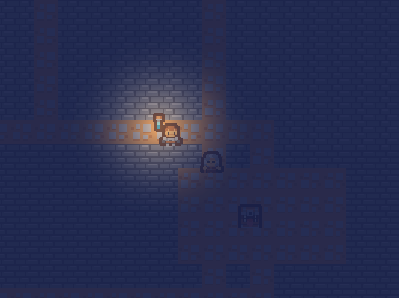

# Lamplight

**Lamplight** is a two-player co-op dungeon crawl over LAN, built on [Storm! Engine v2](https://github.com/SamsWebs/storm-engine-v2) 2.3.0. One shared lamp, procedural levels from a seed, and what you cannot see can reach you.

- **Core loop**: generate → descend → swing or save the shot → hand the lamp over → open chests, kill monsters, reach the far room together
- **One lamp between two players**: the lit pool moves with its carrier, so a player working alone is reading the dark by the glow left behind
- **Darkness is the mechanic**: the vignette is near-opaque outside the lamp's radius, so running off-screen isn't a style choice - it's the whole game
- **Monsters wake just past your light**: they emerge where the lamp's edge is, which means the dark side is where death lives
- **Host-authoritative everything except position**: the joiner reports where it is; the host decides what damage landed. A client never claims a kill.
- **The dungeon is a pure function of a seed**, generated on both machines independently - so it spec'd hardest, determinism first, before anything drew
- **Monsters near you only**: the snapshot's 256-item cap drives a 480px cull radius, which doubles as the visibility model
- **BDD specs** cover the generator, camera, grid collision, combat, world rules, input, and a real loopback handshake (see `specs/`)

Clean C++17, no frameworks beyond SDL2 + the engine. Build: `make && make run`.



Built on [Storm! Engine v2](https://github.com/SamsWebs/storm-engine-v2) 2.3.0.

## Controls

| Input | Action |
|-------|--------|
| `WASD` / arrows | Move |
| `Space` | Melee swing |
| `F` | Fire ranged shot |
| `E` | Pick up lamp / open chest / drop lamp (context) |
| `Esc` | Quit |

**Gamepad (Xbox-style layout)**:

| Input | Action |
|-------|--------|
| Left stick | Move (proportional) |
| Right stick | Aim |
| A | Melee swing |
| X / RT | Fire ranged shot |
| B | Context (pick up lamp / open chest / drop) |
| Start | Quit |

## Why this game

As an example for **Storm! Engine**. Host-authoritative joiner-position co-op is the load-bearing test for three engine pieces used as designed: `NetServer`/`NetClient` chunking semantics, full-snapshot world state every tick, and a shared `LightingOverlay` whose single key light is a sprite on the world map, not a screen effect. Everything else - the generator, steering, hit tests, lamp plumbing - is pure, testable code with no engine dependency, which is what keeps a LAN game honest.

### What it will not showcase

No prediction, no reconciliation, no late-join: all sidestepped deliberately because position is the joiner's authority. Sound, multiple levels, and a third player stay out of v1.

## Build

### Linux

The engine must be installed first (`sudo make -f Makefile.debian install` in the engine tree). Then:

```bash
make          # build
make run      # run from this directory - asset paths are CWD-relative
```

### Tests

BDD specs via igloo, one binary per area. The pure logic (generator, world, camera, combat) links without the renderer; the net spec links the engine because it drives real loopback sockets.

```bash
make -f Makefile.specs test            # every spec
make -f Makefile.specs test-dungeon    # one area
```

### Play

```bash
./bin/lamplight                 # solo
./bin/lamplight host 5000       # terminal one
./bin/lamplight join 127.0.0.1 5000  # terminal two
```

### Windows (x64, MinGW-w64 cross-compile from Linux)

Download the SDK zip from the [Storm! Engine releases](https://github.com/SamsWebs/storm-engine-v2/releases/latest), unpack it, and point `SDK` at the unpacked directory:

```bash
sudo apt install mingw-w64
make -f Makefile.win SDK=~/sdk/stormengine2-2.3.0-win64
```

**MinGW-w64 only.** MSVC cannot link this, the import library and C++ ABI are GCC's.

## Raspberry Pi / Android / LibNX

The engine is portable, so this project is portable. You will need a platform Makefile and a platform `main()` that calls `Game::Run()`; see the engine's `examples/`.

## License

Totally free, do what you want, but don't blame me if it breaks. [LICENSE.md](LICENSE.md) is the full text.
